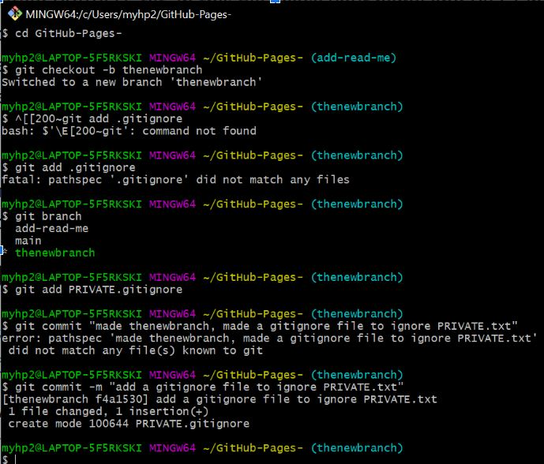

# Sarena Pham

## About me:
1. I want to learn web development
2. I want to learn robotics.
3. I hike and watch tv for fun.

### Favorite programming language:
- Java provides automatic memory management through a process called garbage collection

**favorite pokemon**

*sample code from system verilog class*
- [ ] include traffic light project code*
`module bmc000 (`
   `input    [1:0] rx_pair,`
   `output   [1:0] path_0_bmc,`
  ` output   [1:0] path_1_bmc);`
   
   `wire tmp00, tmp01, tmp10, tmp11;`

# External links
[ linkedin](https://www.linkedin.com)
- [ ] update the linkedin
# Section links
**jump to assignment screenshot1**

**jump to assignment screenshot2**
- [ ] include robot project
**jump to robot project images+code**
**jump to random.md file**
[visit random.md](random.md)

# Personal Projects
**jump to project1,2,etc**

- [x] finish this lab
- [ ] organize my github
- [ ] work on the project

