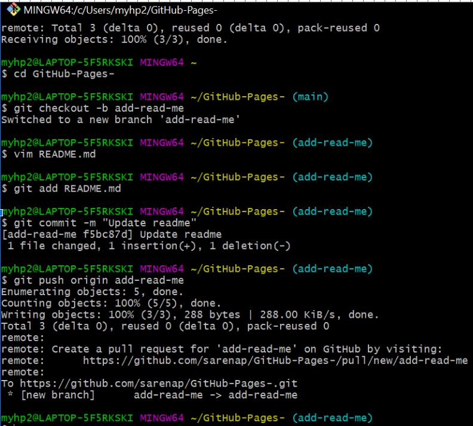

# Sarena Pham

###This site was made with Github pages:
[GitHub Pages](https://pages.github.com/)

## About me:
1. I want to learn web development
2. I want to learn robotics.
3. I hike and watch tv for fun.

### Favorite programming language:
- Java provides automatic memory management through a process called garbage collection

**favorite pokemon**

*Favorite quote*
>Nah, I'd win.

*quoting code from system verilog class*
- [ ] include traffic light project code*
`module bmc000 (`
   `input    [1:0] rx_pair,`
   `output   [1:0] path_0_bmc,`
  ` output   [1:0] path_1_bmc);`
   
   `wire tmp00, tmp01, tmp10, tmp11;`

# External links
[ linkedin](https://www.linkedin.com)
- [ ] update the linkedin
# Section links
***jump to assignment screenshot1 as an image***

***jump to assignment screenshot2 as a relative link***
[part 2 screenshot](Screenshots/cse110cmd2.JPG)

- [ ] include robot project
**jump to robot project images+code**
**link to random.md file as a relative link**
[visit random.md](GitHub-Pages-/random.md)

# Personal Projects
**jump to project1,2,etc**

- [x] finish this lab
- [ ] organize my github
- [ ] work on the project
~~ stuff ~~

*show an image as a relative link*
[ currently watching : ](https://www.google.com/search?sca_esv=5bfd57f04013e41c&sca_upv=1&q=spy+x+family&uds=AMwkrPutJ-__Ia2m5cqSncI5GW6OPYAuDh0KkSLWaam02g-EYXtMmEBshtdZUWFS6bA4n_w6W8sgK5Bhfsz-90L90bXb8Jbo76gt7Z2cGFsdupsx-Ba3kDZV58N_8yR-Aaq7uFVxANnh7PctEJ-yjh7zXS0NevqeN2WXDDYmugF7Wc7lHJO1BaMD5_alY3ce93W2fDfEqEq7xuNHRxbYUj9gNXM4RYEBPl3xobMG9L7T6jxKJv5coiyNecqOOxoXTkee25CldV84rMYBWj2SpQvxXrUP4fZ80ksEjPoHNYBqfqwhK16urWA&udm=2&prmd=ivsnmbtz&sa=X&ved=2ahUKEwj5_Jrt6bCFAxUvl-4BHWjjAkkQtKgLegQIDBAB&biw=1258&bih=611&dpr=1.5#vhid=LIPwu34MGtG55M&vssid=mosaic)